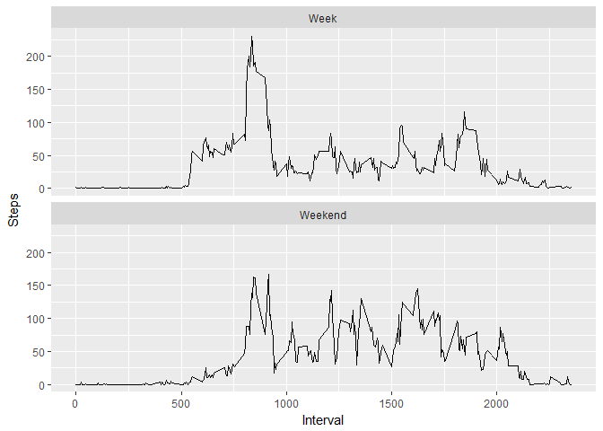

# Reproducible Research: Peer Assessment 1


## Loading and preprocessing the data

```r
data <- read.csv(unz("activity.zip", "activity.csv"), header=T)  
aggdata <-aggregate(data$steps, by=list(data$date), FUN=sum,na.rm = TRUE)  
```
*** 
## What is mean total number of steps taken per day?

```r
names(aggdata)<-c("Days","Steps")  
hist(aggdata$Steps,xlab="Steps taken in a day", main="",breaks=10)  
```

<!-- -->
  
* The mean is 9354.23  
* The median is 10395 
  
***   
   
## What is the average daily activity pattern? 

```r
tdata<-aggregate(data$steps, by=list(data$interval), FUN=mean,na.rm = TRUE) 
names(tdata)<-c("Interval","Steps") 
plot(tdata$Interval,tdata$Steps,type="l",xlab="interval",ylab="Ave. steps in interval")  
```

<!-- -->

The maximum average step count is at interval 835

***   
## Imputing missing values  

```r
data2<-data  
for(i in 1:nrow(data2))  {    
if (is.na(data2[i,1]))   {   
temp<-tdata[tdata$Interval==data2[i,3],]  
  data2[i,1] <- temp[1,2]  
}  
}  
aggdata2 <-aggregate(data2$steps, by=list(data2$date), FUN=sum,na.rm = TRUE)  
names(aggdata2)<-c("Days","Steps") 
hist(aggdata2$Steps,xlab="Steps taken in a day", main="",breaks=10)  
```

<!-- -->
  
* The mean is 10766.19
* The median is 10766.19 
  
  Adding the missing numbers has brought the mean to equal the median.
  
*** 
  
## Are there differences in activity patterns between weekdays and weekends?  

```r
data2$weekday<-weekdays(as.Date(data2$date,'%Y-%m-%d'))  
data2$level<-"Week"  
data2$level[data2$weekday=="Saturday"]<-"Weekend"  
data2$level[data2$weekday=="Sunday"]<-"Weekend"
tdata2<-aggregate(data2$steps, by=list(data2$interval,data2$level), FUN=mean,na.rm = TRUE)
names(tdata2)<-c("Interval","Level","Steps") 
library(ggplot2)
```

```
## Warning: package 'ggplot2' was built under R version 3.3.3
```

```r
ggplot(tdata2,aes(Interval,Steps,))+geom_line()+facet_wrap(~Level,nrow=2)
```

<!-- -->
  
Looks like the subject got up a bit later on thw weekend!
